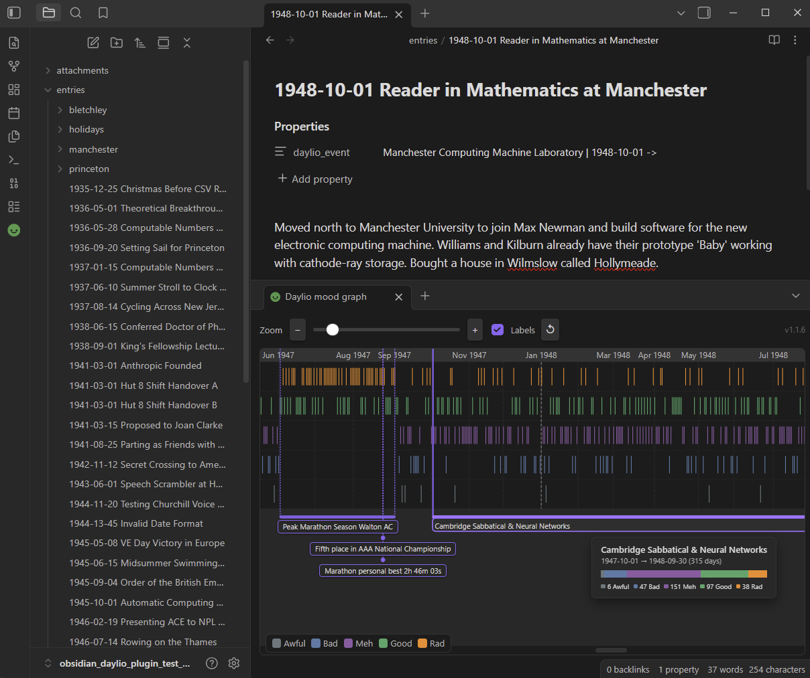

# Daylio Mood Graph — Obsidian Plugin

[](../../releases/tag/demo-vault)

An [Obsidian](https://obsidian.md/) plugin that renders [Daylio](https://daylio.net/) mood data as a color-coded graph, annotated with Obsidian vault entries.

## Quick Start / Demo Vault

Try out the plugin with pre-populated sample data:

Download the **[Example Vault Zip](../../releases/download/demo-vault/example-vault-daylio-demo.zip)**, extract it, and open it in Obsidian to see a working graph with sample entries and event annotations out of the box.



## Installation

### From the Community Plugin browser (once published)

1. Open **Settings → Community plugins → Browse**.
2. Search for **Daylio Mood Graph** and install.
3. Enable the plugin.

### Manual installation

1. Download `main.js`, `main.js.map`, `manifest.json`, and `styles.css` from the latest [GitHub release](../../releases/latest).
2. Copy them into the Obsidian vault at: `<OBSIDIAN_VAULT_ROOT>/.obsidian/plugins/daylio-mood-graph/`
3. In Obsidian: **Settings → Community plugins** → enable **Daylio Mood Graph**.

## Setup

### 1. Export data from Daylio

In the Daylio app: **More → Export Entries → CSV (table)**.
Move the resulting file into the Obsidian vault, e.g. `<OBSIDIAN_VAULT_ROOT>/attachments/daylio_export_2026_08_19.csv`

### <a name="iso_date_filenames"></a> 2. Format Obsidian archive's entries' filenames
To associate entries with specific dates, the `.md` file names must begin with an ISO date, e.g:
```
2020-04-13 First Corona Lockdown.md
```

### 3. Tell the plugin where the CSV is

**Settings → Daylio Mood Graph → CSV file path**. Enter the path relative
to the Obsidian vault root, e.g.:

```
attachments/daylio_export.csv
```

### 4. Open the graph

Select the smiley-face icon in the left ribbon, or run the command
**Daylio Mood Graph: Open mood graph** from the command palette
(`Ctrl+P` / `Command+P`).

The graph opens as a horizontal split pane below the active note.

## Annotating the graph with vault events

Vault notes can annotate the graph in two ways: **Point Events** (single-date milestones) and **Range Events** (multi-day timeline spans).

1. Inside an Obsidian entry, press `Ctrl+;` (Windows/Linux) or `Command+;` (macOS) to add a note property, or run the command **Add file property** from the command palette (`Ctrl+P` / `Command+P`).
2. Set the property name to `daylio_event`.
3. Write the name of the event, and specify date range if needed:


### 1. Point Events
```yaml
---
daylio_event: "Began university"
---
```

By default, the date of the event will be [taken from the entry's filename](#iso_date_filenames). To override it, use the pipe `|` sytnax:

```yaml
---
daylio_event: "Began university | 2003-04-05"
---
```

Multiple point events can be specified in a single note using Obsidian's native List property:

```yaml
---
daylio_event:
  - "Got a cat"
  - "Got a dog"
  - "Got a ferret | 2026-08-20" 
---
```

### 2. Range Events

For multi-day events that span across a date range, use the inline pipe (`|`) and arrow (`->`) syntax:

```yaml
---
daylio_event: Summer Vacation | 2026-07-12 -> 2024-07-28
---
```

Point events and multiple range events can also be combined in list properties:

```yaml
---
daylio_event:
  - Got a cat
  - Summer Vacation | 2026-07-12 -> 2026-07-28
  - Ongoing Project | 2026-03-01 ->
---
```

An unspecified end-date is treated as an ongoing event.

## Settings

| Setting | Description | Default |
|---|---|---|
| CSV file path | Path to Daylio CSV export, relative to the vault root | *(empty)* |
| Event scan folder | Restrict vault-event scanning to this folder (leave blank to scan the whole vault) | *(empty)* |
| Show event labels | Whether event label cards are shown below the graph | On |
| Mood colors | A color picker for each of the five mood levels | Daylio palette |

## Compatibility

- **Minimum Obsidian version:** 0.15.0
- **Platforms:** desktop and mobile

## Development

### Building

```bash
npm install # first time only
npm run build
```

After building, copy `build/main.js`, `build/main.js.map`, `manifest.json`,
and `styles.css` into the Obsidian vault's plugin folder and reload Obsidian.
The shorthand `npm run update:test-vault` builds and copies in one step.

> [!TIP]
> **Developer Workflow Tip:** It is recommended to keybind Obsidian's built-in command **"Reload app without saving"** to a keyboard shortcut such as `Ctrl+R` (Windows/Linux) or `Command+R` (macOS) under **Settings → Hotkeys**. This enables a rapid development loop: run `npm run update:test-vault`, switch to Obsidian, and press `Ctrl+R` (or `Command+R`) to see changes instantly.

### Running the tests

The test suite uses [Vitest](https://vitest.dev) and requires no Obsidian
runtime — the Obsidian API is replaced by a minimal stub for unit tests, and
the integration tests read real files directly from `obsidian_daylio_plugin_test_vault/`.

---
## Technical Details

### Architecture & Data Flow

1. **`DaylioGraphView`** (`src/graph-view.ts`): Extends `ItemView` (`VIEW_TYPE_DAYLIO = "daylio-mood-graph"`). Manages layout, controls (zoom slider/buttons, event checkbox), tooltip rendering, and horizontal scroll sync.
2. **`buildGraphSvg`** (`src/graph-builder.ts`): Pure synchronous function. Builds SVG element tree containing date headers, lane dividers, mood bars, month lines, event connector lines, event pills/cards, and hover overlays.
3. **`scanVaultEvents`** (`src/vault-scanner.ts`): Scans the vault for dated notes (`YYYY-MM-DD` in filename). Parses `daylio_event` and `daylio_events` properties (including ranges like `Label | 2024-01-01 -> 2024-01-15`, `to`, `..`, and ongoing ranges).
4. **`parseDaylioCsv` & `groupByDay`** (`src/csv-parser.ts`): Parses Daylio CSV exports, normalizes moods, and groups entries by chronological dates.
5. **Testing**: Unit tests run against pure modules using mock `App` object. Integration tests read `obsidian_daylio_plugin_test_vault/attachments/daylio_export.csv` and all the `.md` notes in `obsidian_daylio_plugin_test_vault/` to verify end-to-end
behaviour against real data, including specific anchor points (known entry
counts, dates, and mood distributions).

The SVG rendering inside `buildGraphSvg` is not covered by automated tests
as it depends on a live browser DOM; test it manually by opening the test
vault in Obsidian.