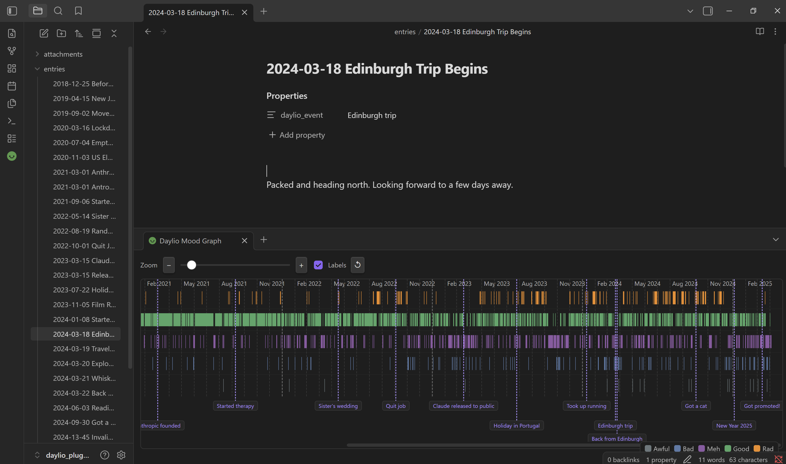

# Daylio Mood Graph — Obsidian Plugin

[](../../releases/latest)

Renders your [Daylio](https://daylio.app) mood history as a colour-coded
graph inside Obsidian. Notes in your vault can annotate the graph with
labelled, clickable markers at the dates they correspond to.

## Quick Start / Demo Vault

Want to try out the plugin with pre-populated sample data?
Download the **[Example Vault Zip](../../releases/latest)**, extract it, and open it in Obsidian to see a working graph with sample entries and event annotations out of the box!

## What it looks like

Each day in your Daylio export becomes a vertical bar. The bar is split into
segments — one per mood entry that day — each coloured by mood level. Days
with no entry are simply absent. Month boundaries are marked with dashed
lines and labels; year boundaries use a slightly bolder line so they stand
out. At maximum zoom-out only year labels are shown to avoid crowding.
The graph scrolls horizontally and defaults to showing the most recent data.



Vault events appear as small labelled cards below the graph (or horizontal swimlane bars for range events), connected to
their date by a dashed connector line. Clicking a card opens the
corresponding note. Hovering over a day column shows the date; hovering
over an event's range highlights the full period that event spans.

## Installation

### From the Community Plugin browser (once published)

1. Open Obsidian → Settings → Community Plugins → Browse.
2. Search for **Daylio Mood Graph** and install.
3. Enable the plugin.

### Manual installation

1. Download `main.js`, `main.js.map`, `manifest.json`, and `styles.css`
   from the latest [GitHub release](../../releases/latest).
   (`main.js` and `main.js.map` are the release assets built from `build/`.)
2. Copy them into your vault at:
   `.obsidian/plugins/daylio-mood-graph/`
3. In Obsidian: Settings → Community Plugins → enable **Daylio Mood Graph**.

## Setup

### 1. Export your data from Daylio

In the Daylio app: **More → Export Entries → CSV (table)**.
Move the resulting file into your vault — `attachments/daylio_export.csv`
is a reasonable location.

### 2. Tell the plugin where the CSV is

Settings → Daylio Mood Graph → **CSV file path**. Enter the path relative
to your vault root, e.g.:

```
attachments/daylio_export.csv
```

### 3. Open the graph

Click the smiley-face icon in the left ribbon, or run the command
**Daylio Mood Graph: Open mood graph** from the command palette
(Ctrl+P / Cmd+P).

The graph opens as a horizontal split pane below the current editor.

## Navigating the graph

**Scrolling:** drag left/right anywhere in the graph area, or use a
horizontal scroll gesture on a trackpad.

**Zooming:**

| Gesture | Effect |
|---|---|
| Toolbar slider | Smooth zoom, persists between sessions |
| Toolbar − / + buttons | Step zoom |
| Ctrl + scroll wheel | Zoom centred on the cursor |
| Right-click + scroll wheel | Same as Ctrl + scroll |

At narrow bar widths (≤ 0.5 px per day) only year labels are shown to keep
the header readable.

## Annotating the graph with vault events

Vault notes can annotate the graph in two ways: **Point Events** (single-date milestones) and **Range Events** (multi-day timeline spans).

### 1. Point Events (Single-Date Milestones)

Add a `daylio_event` field to the frontmatter of any note whose filename starts with `YYYY-MM-DD`:

```yaml
---
daylio_event: "Began university"
---
```

You can also specify multiple point events in a single note using Obsidian's native List property:

```yaml
---
daylio_event:
  - "Got a cat"
  - "Got a dog"
---
```

### 2. Range Events (Multi-Day Timeline Spans / Gantt Swimlanes)

For multi-day events that span across a date range ($T_{\text{start}} \rightarrow T_{\text{end}}$), use any of these natural formats:

#### Option A: Native Properties UI (`daylio_end`)
```yaml
---
daylio_event: Summer Vacation
daylio_end: 2024-08-28
---
```
*(Uses Obsidian's native Date picker for `daylio_end`. The start date defaults to the note's filename date prefix or `daylio_start`.)*

#### Option B: Inline Pipe Syntax in Properties List
```yaml
---
daylio_event:
  - Got a cat
  - Summer Vacation | 2024-08-12 -> 2024-08-28
---
```

Range Events render as horizontal swimlane pill bars below the mood graph. Overlapping events are automatically organized into separate non-overlapping tracks. Clicking any pill opens the corresponding note!

The plugin reads frontmatter through Obsidian's metadata cache — it never
needs to open your notes — so scanning is fast regardless of vault size.

**Notes on the convention:**

- The `daylio_event` value must be a non-empty string.
- Only one event label is shown per date. If two notes share the same date
  prefix, one will silently take precedence (avoid duplicates).
- The date in the filename must correspond to a day that exists in the CSV;
  otherwise the label has no bar to attach to and is not shown.
- Frontmatter is stripped during PDF export, so `daylio_event` never appears
  in printed or exported versions of your notes.

Event labels can be toggled on and off with the **Labels** checkbox in the
graph toolbar without losing your scroll position.

## Settings

| Setting | Description | Default |
|---|---|---|
| CSV file path | Path to your Daylio CSV export, relative to the vault root | *(empty)* |
| Event scan directory | Restrict vault-event scanning to this subdirectory (leave blank to scan the whole vault) | *(empty)* |
| Show event labels | Whether event label cards are shown below the graph | On |
| Mood colours | A colour picker for each of the five mood levels | Daylio palette |
| Reset colours | Restores the default Daylio colour palette | — |

The zoom level is controlled by the toolbar slider and persists between
sessions.

## Mood levels and default colours

| Level | Default colour |
|---|---|
| <span style="color:#f78c1e">Rad</span> | `#f78c1e` (orange) |
| <span style="color:#41a766">Good</span> | `#41a766` (green) |
| <span style="color:#9056a3">Meh</span> | `#9056a3` (purple) |
| <span style="color:#5579a7">Bad</span> | `#5579a7` (blue) |
| <span style="color:#6a777c">Awful</span> | `#6a777c` (grey) |

All colours are customisable in settings and respect your Obsidian theme for
surrounding UI elements.

## Compatibility

- **Minimum Obsidian version:** 0.15.0
- **Platforms:** desktop and mobile

## Development

### Building

```bash
npm install          # first time only
npm run dev          # watch mode with inline source maps
npm run build        # production bundle (type-checks first)
```

After building, copy `build/main.js`, `build/main.js.map`, `manifest.json`,
and `styles.css` into your vault's plugin folder and reload Obsidian
(Ctrl+R / Cmd+R). The shorthand `npm run build:vault` builds and copies
in one step.

### Running the tests

The test suite uses [Vitest](https://vitest.dev) and requires no Obsidian
runtime — the Obsidian API is replaced by a minimal stub for unit tests, and
the integration tests read real files directly from `daylio_plugin_test_vault/`.

```bash
npm test                # run all tests once (unit + integration)
npm run test:watch      # re-run on every file save
npm run test:coverage   # run with coverage report
```

#### Test structure

```
tests/
├── unit/
│   ├── csv-parser.test.ts      isMoodLevel, parseCsvLine,
│   │                           parseDaylioCsv, groupByDay
│   └── vault-scanner.test.ts   scanVaultEvents (with mock App)
├── integration/
│   └── test-vault.test.ts      real CSV and real vault notes
└── helpers/
    └── vault-reader.ts         filesystem helper used by integration tests
```

Unit tests cover the CSV parser and vault scanner logic using a mock Obsidian
`App` object. Integration tests read `daylio_plugin_test_vault/attachments/daylio_export.csv`
and all the `.md` notes in `daylio_plugin_test_vault/` to verify end-to-end
behaviour against real data, including specific anchor points (known entry
counts, dates, and mood distributions).

The SVG rendering inside `buildGraphSvg` is not covered by automated tests
as it depends on a live browser DOM; test it manually by opening the test
vault in Obsi